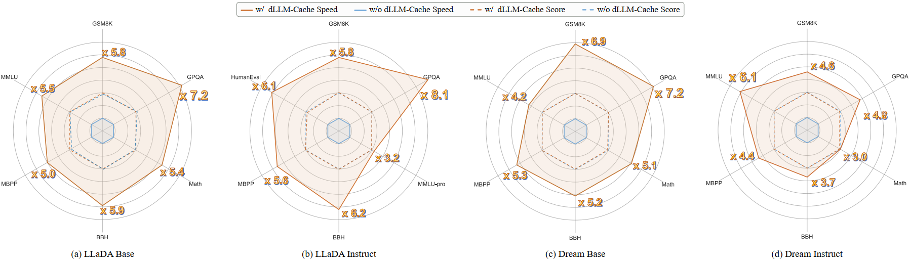

# dLLM-Cache: Accelerating Diffusion Large Language Models with Adaptive Caching

Official PyTorch implementation of the paper **["dLLM-Cache: Accelerating Diffusion Large Language Models with Adaptive Caching"](https://arxiv.org/abs/2506.06295)** (dLLM-Cache).

## :fire: News
- [2025/06/15] Our dLLM-Cache is integrated into [MMada](https://github.com/Gen-Verse/MMaDA).
- [2025/05/31] Our dLLM-Cache is integrated into [LLaDA-V](https://github.com/ML-GSAI/LLaDA-V).
- [2025/05/23] The code of our paper has been released.
- [2025/05/22] Our paper has been released.

## ✨️ Key Highlights


- **Currently supported models**: [LLaDA](https://github.com/ML-GSAI/LLaDA), [Dream](https://github.com/HKUNLP/Dream), [LLaDA-V](https://github.com/ML-GSAI/LLaDA-V) and [MMada](https://github.com/Gen-Verse/MMaDA).
- **Speedup**: Achieves up to **9.1x** speedup over standard dLLM pipelines, with **no performance loss** on most tasks.
- **Evaluation**: Evaluated on [LLaDA 8B](https://arxiv.org/abs/2502.09992) and [Dream 7B](https://hkunlp.github.io/blog/2025/dream/).
- **Latency**: Approaches ARM-level inference speeds in many scenarios.

## :rocket: Pipeline

Here's an overview of the process behind our **dLLM-Cache** method:


## 🛠️ Installation

To get started with dLLM-Cache, follow the installation instructions below.

1. Clone the Repository:
```sh
git clone https://github.com/maomaocun/dLLM-Cache.git
cd dLLM-Cache
```

2. Set Up the Environment:
Create a Python environment with `conda` or `virtualenv` and install dependencies:
```bash
bash install.sh
```

3. Demo:

```bash
python demo_{model_name}.py
```

4. Running Experiments:
Run experiments using the provided scripts:

```bash
bash scripts/run_{model_name}_{task_name}_base.sh
```
### :blue_book: Example Usage
1. GSM8K with LLaDA
```bash
bash scripts/run_LLaDA_gsm8k_base.sh
```

2. BBH with Dream
```bash
bash scripts/run_Dream_bbh_base.sh
```


## :postbox: Contact
If you have any questions, please email [yangyicun187@gmail.com](mailto:yangyicun187@gmail.com).


## 🎉 Acknowledgements
This repository was built off of [LLaDA](https://github.com/ML-GSAI/LLaDA), [Dream](https://github.com/HKUNLP/Dream), [LLaDA-V](https://github.com/ML-GSAI/LLaDA-V) and [lm-evaluation-harness](https://github.com/EleutherAI/lm-evaluation-harness).

## :pushpin: Citation
If you find dLLM-Cache useful for your research and applications, please cite using this BibTeX:

```bibtex
@article{liu2025dllm,
  title={dLLM-Cache: Accelerating Diffusion Large Language Models with Adaptive Caching},
  author={Liu, Zhiyuan and Yang, Yicun and Zhang, Yaojie and Chen, Junjie and Zou, Chang and Wei, Qingyuan and Wang, Shaobo and Zhang, Linfeng},
  journal={arXiv preprint arXiv:2506.06295},
  year={2025}
}
```

## :star2: Star History

[](https://www.star-history.com/#maomaocun/dLLM-cache&Timeline)

